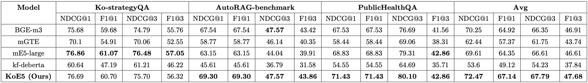

# KoE5: 한국어 특화 임베딩 모델

## Update Logs
- 2024.10.02: [🤗KoE5](https://huggingface.co/nlpai-lab/KoE5)), [🤗ko-triplet-v1.0](https://huggingface.co/datasets/nlpai-lab/ko-triplet-v1.0) 공개

---

<br>

KoE5는 고려대학교 [NLP & AI 연구실](http://nlp.korea.ac.kr/)과 [HIAI 연구소](http://hiai.korea.ac.kr)가 개발한 한국어 특화 임베딩 모델입니다.

KoE5를 공개합니다.  
<br/>

## KoE5 검색 성능 결과


## KoE5 모델 실행 코드
### sentence-transformers로 실행
```bash
pip install sentence-transformers
```

아래 예제 코드로 실행해볼 수 있습니다.

```python
from sentence_transformers import SentenceTransformer

# Download from the 🤗 Hub
model = SentenceTransformer("nlpai-lab/KoE5")

# Run inference
sentences = [
    'query: 헌법과 법원조직법은 어떤 방식을 통해 기본권 보장 등의 다양한 법적 모색을 가능하게 했어',
    'passage: 4. 시사점과 개선방향 앞서 살펴본 바와 같이 우리 헌법과 ｢법원조직 법｣은 대법원 구성을 다양화하여 기본권 보장과 민주주의 확립에 있어 다각적인 법적 모색을 가능하게 하는 것을 근본 규범으로 하고 있다. 더욱이 합의체로서의 대법원 원리를 채택하고 있는 것 역시 그 구성의 다양성을 요청하는 것으로 해석된다. 이와 같은 관점에서 볼 때 현직 법원장급 고위법관을 중심으로 대법원을 구성하는 관행은 개선할 필요가 있는 것으로 보인다.',
    'passage: 연방헌법재판소는 2001년 1월 24일 5:3의 다수견해로 「법원조직법」 제169조 제2문이 헌법에 합치된다는 판결을 내렸음 ○ 5인의 다수 재판관은 소송관계인의 인격권 보호, 공정한 절차의 보장과 방해받지 않는 법과 진실 발견 등을 근거로 하여 텔레비전 촬영에 대한 절대적인 금지를 헌법에 합치하는 것으로 보았음 ○ 그러나 나머지 3인의 재판관은 행정법원의 소송절차는 특별한 인격권 보호의 이익도 없으며, 텔레비전 공개주의로 인해 법과 진실 발견의 과정이 언제나 위태롭게 되는 것은 아니라면서 반대의견을 제시함 ○ 왜냐하면 행정법원의 소송절차에서는 소송당사자가 개인적으로 직접 심리에 참석하기보다는 변호사가 참석하는 경우가 많으며, 심리대상도 사실문제가 아닌 법률문제가 대부분이기 때문이라는 것임 □ 한편, 연방헌법재판소는 「연방헌법재판소법」(Bundesverfassungsgerichtsgesetz: BVerfGG) 제17a조에 따라 제한적이나마 재판에 대한 방송을 허용하고 있음 ○ 「연방헌법재판소법」 제17조에서 「법원조직법」 제14절 내지 제16절의 규정을 준용하도록 하고 있지만, 녹음이나 촬영을 통한 재판공개와 관련하여서는 「법원조직법」과 다른 내용을 규정하고 있음',
]
embeddings = model.encode(sentences)
print(embeddings.shape)
# [3, 1024]

# Get the similarity scores for the embeddings
similarities = model.similarity(embeddings, embeddings)
print(similarities)
# tensor([[1.0000, 0.6721, 0.3897],
#        [0.6721, 1.0000, 0.3740],
#        [0.3897, 0.3740, 1.0000]])
```

<br/>

## Training Details
KoE5는 [intfloat/multilingual-e5-large](https://huggingface.co/intfloat/multilingual-e5-large)를 기반으로 fine-tuning된 모델입니다.
### Training Data
- [ko-triplet-v1.0](https://huggingface.co/datasets/nlpai-lab/ko-triplet-v1.0)
- 한국어 query-document-hard_negative 데이터 쌍 (open data)
- 약 700000+ examples

### Training Procedure
- **loss:** Sentence-transformers의 **[CachedMultipleNegativesRankingLoss](https://sbert.net/docs/package_reference/sentence_transformer/losses.html#cachedmultiplenegativesrankingloss)** 을 사용했습니다.
- **batch size:** 512
- **learning rate:** 1e-05
- **epochs:** 1

<br/>

## Evaluation
### Metrics
- NDCG@1, F1@1, NDCG@3, F1@3
### Benchmark Datasets
- Ko-strategyQA
- AutoRAG-benchmark
- PublicHealthQA

<br/>

## 주의사항

- 학습 시 사용된 prefix를 붙여 주어야 합니다. (query: {query}, passage: {positive}, document: {negative})
  
## License
- ```MIT```

## Citation

If you find our paper or models helpful, please consider cite as follows:
```text
@misc{KoE5,
  author = {NLP & AI Lab and Human-Inspired AI research},
  title = {KoE5: A New Dataset and Model for Improving Korean Embedding Performance},
  year = {2024},
  publisher = {Youngjoon Jang, Junyoung Son, Taemin Lee},
  journal = {GitHub repository},
  howpublished = {\url{https://github.com/nlpai-lab/KoE5}},
}
```
